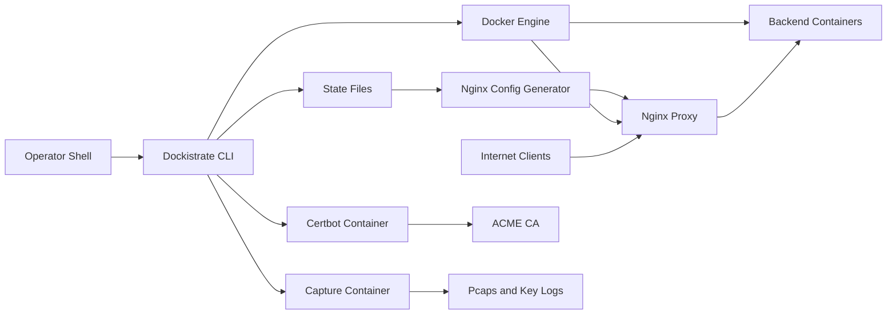

## Executive summary
Dockistrate is a Bash CLI and interactive operator tool that manages an internet-facing Nginx proxy, Dockerized backends, generated Nginx configuration, certificates, ACLs/security rules, backups, diagnostics, and packet capture state. The dominant risk themes are privileged local control of Docker and `state/`, remote exposure through generated HTTP/HTTPS/TCP/UDP listeners, intentional operator escape hatches such as raw Nginx directives and Docker runtime options, and sensitive runtime artifacts such as TLS keys, mTLS material, packet captures, and TLS key logs. The current codebase has meaningful exploit-prevention controls around state schemas, runtime path containment, generated-config validation, transaction rollback, and restricted file modes, but those controls assume trusted high-privilege operators and OS-level protection of the checkout and `state/` tree.

## Scope and assumptions
In-scope paths:
- Runtime entrypoint and command dispatch: `dockistrate.sh`, `lib/cli/run_command.sh`, and `lib/**`.
- Runtime state and generated configuration: `state/` as defined by `lib/config/common.sh`, CSV schemas in `lib/utils/state_csv.sh`, runtime guards in `lib/runtime_paths.sh`, and generated Nginx config under `state/config/nginx_conf`.
- Docker, Nginx, Certbot, TLS, mTLS, ACL/security-rule, backup/restore, cleanup, diagnostics, packet capture, and advanced override workflows in `lib/`.

Out-of-scope items:
- Tests, local mocks, and documentation examples except where they describe intended runtime behavior.
- Vulnerability assessment of third-party Docker images, Nginx, Docker Engine, OpenSSL, Certbot, or tcpdump themselves.
- Backends managed by Dockistrate beyond their network/routing relationship to the proxy.

Assumptions grounded in repository state:
- Dockistrate is intended for trusted, high-privilege infrastructure operators with shell and Docker access. Evidence: `README.md` Security Model; repository operator guidance.
- Nginx is expected to be internet-facing when ports are exposed, while the CLI, checkout, Docker socket, and `state/` filesystem are local administrative surfaces. Evidence: `README.md` Quick Start, `lib/nginx/recreate_nginx_container.sh`.
- Operator flexibility is intentional: weak TLS choices, broad trusted proxy ranges, raw Nginx directives, and risky Docker runtime flags may be valid admin choices. The model treats those as high-risk configuration surfaces, not automatically as product defects. Evidence: `README.md` Security Model, `docs/guides/advanced-nginx-docker-options.md`.
- The current `state/` tree should be writable only by trusted operators. If untrusted local users can run the CLI or modify `state/`, several risks become critical.
- ACL and security-rule IP selectors are IPv4-only in the current runtime model. IPv6 clients must be handled by upstream network policy, proxy topology, or future explicit IPv6 support rather than assuming Dockistrate IP ACL rows cover them.
- Data sensitivity varies by deployment. The model assumes production deployments may carry credentials, PII, session cookies, API tokens, or regulated data through proxied traffic and packet captures.

Open questions that would materially change risk ranking:
- Will production deployments be single-operator/single-tenant, or can multiple admins or tenants share one host, Docker daemon, proxy, or `state/` tree?
- Are any managed backends expected to process regulated or highly sensitive data, and are packet capture/TLS decrypt workflows allowed in those environments?
- Is Dockistrate deployed directly on internet-reachable hosts, behind a trusted load balancer, or only on private infrastructure?

## System model
### Primary components
- CLI and interactive picker: parses operator commands, loads modules, prepares runtime state, and dispatches workflows. Evidence: `dockistrate.sh`, `lib/cli/run_command.sh`.
- State/config store: CSV-backed state, global settings, TLS/mTLS metadata, Docker options, Nginx directive overrides, ACL/security rules, logs, backups, pcaps, and temporary files under `state/`. Evidence: `lib/config/common.sh`, `lib/utils/state_csv.sh`.
- Runtime path and permission guard layer: rejects symlinked/out-of-root runtime paths and tightens sensitive file modes. Evidence: `lib/runtime_paths.sh`, `lib/config/bootstrap_config_runtime.sh`, `lib/permissions/common.sh`.
- Nginx generator and lifecycle manager: renders HTTP/stream config, default 444 servers, ACL/security includes, header maps, TLS/mTLS directives, and recreates/reloads the managed proxy container. Evidence: `lib/nginx/update_nginx_config.sh`, `lib/nginx/recreate_nginx_container.sh`, `lib/nginx/fix_default_config.sh`.
- Backend Docker orchestration: starts, updates, stops, rolls back, and tracks backend containers and Docker networks. Evidence: `lib/backends/add_backend.sh`, `lib/backends/update_backend.sh`, `lib/backends/common.sh`.
- Security controls and customization surfaces: ACLs/security rules, trusted proxy/real-IP settings, headers, typed/raw Nginx directives, TLS overrides, and Docker runtime options. Evidence: `lib/security_rules/_sr_builders.sh`, `lib/headers/_build_header_files.sh`, `lib/nginx_directives/render.sh`, `lib/backends/validate_docker_opts.sh`.
- Certificate, mTLS, ACME, backup, restore, cleanup, and diagnostics tools. Evidence: `lib/certs/add_cert.sh`, `lib/mtls/*.sh`, `lib/backups/common.sh`, `lib/capture/start_capture.sh`.

### Data flows and trust boundaries
- Operator shell -> Dockistrate CLI: command arguments, interactive prompt answers, image refs, Docker options, domains, ports, headers, cert paths, directive values, ACL/security rules, backup names, and capture filters cross from a trusted local operator into shell code. Validation is command-specific and includes domain/port/image/header/path/status checks. There is no user authentication layer because this is a local privileged tool.
- Dockistrate CLI -> State filesystem: CSV rows, global settings, Nginx includes, certs, mTLS material, backups, audit logs, pcaps, and TLS-decrypt state are written under `state/`. Security guarantees depend on OS permissions plus runtime path guards, CSV headers/column counts, temp-file finalization, transactions, and restricted file modes. Evidence: `lib/runtime_paths.sh`, `lib/config/save_config.sh`, `lib/utils/state_csv.sh`, `lib/backups/common.sh`.
- State filesystem -> Nginx config generator: persisted state is re-parsed and rendered into Nginx HTTP/stream config. Persisted rows are treated as a trust boundary and fail closed on malformed backend, port, path, header, ACL, trusted-proxy, directive, TLS, and certificate references. Evidence: `lib/nginx/update_nginx_config.sh`, `lib/headers/common.sh`, `lib/security_rules/_sr_builders.sh`, `lib/nginx_directives/render.sh`.
- Dockistrate CLI -> Docker Engine: the CLI creates/removes containers, connects networks, inspects metadata, reloads Nginx, and runs Certbot/capture containers. Docker access is equivalent to host-administrative control in many deployments. Dockistrate reserves its own container names, labels, mounts, published ports, networks, and cleanup behavior, but does not block every risky operator-selected Docker flag. Evidence: `lib/backends/validate_docker_opts.sh`, `lib/nginx/recreate_nginx_container.sh`.
- Internet clients -> Nginx proxy container: HTTP, HTTPS, TCP, UDP, and HTTP/3 traffic reaches published ports. Nginx applies host/port/path routing, optional TLS/mTLS, default 444 servers for unmatched hosts, optional trusted proxy real-IP handling, ACL/security rules, headers, redirects, and directive overrides. Evidence: `lib/nginx/update_nginx_config.sh`, `lib/nginx/fix_default_config.sh`, `lib/nginx/_backend_mtls_directives.sh`.
- Nginx proxy container -> Backend containers: proxied traffic crosses Docker networks to backend IP/port targets. Nginx joins backend networks and disconnects unused networks, but container network isolation is still an operator design decision. Evidence: `lib/nginx/common.sh`, `lib/nginx/remove_unused_nginx_networks.sh`.
- Dockistrate CLI -> Certbot container -> ACME CA: certificate issuance uses Dockerized Certbot, mounted cert/acme-webroot directories, optional webroot mode through Nginx, and standalone port 80 mode when Nginx is not running. Evidence: `lib/certs/add_cert.sh`, `lib/certs/common.sh`.
- Dockistrate CLI -> Capture container -> Packet captures/TLS key logs: diagnostics can run `tcpdump` in the Nginx network namespace and optionally enable TLS key logging. Capture output and TLS key logs are sensitive local artifacts with containment checks and restricted modes. Evidence: `lib/capture/start_capture.sh`, `lib/capture/common.sh`, `lib/nginx/recreate_nginx_container.sh`.

#### Diagram

## Assets and security objectives
| Asset | Why it matters | Security objective (C/I/A) |
| --- | --- | --- |
| Docker Engine access | Container creation, mounts, networks, and image execution can affect host integrity and availability | I/A |
| `state/config/*.csv` and generated Nginx includes | Routing, backend inventory, ACLs, headers, TLS overrides, directives, and Docker options directly drive runtime behavior | I/A |
| `state/config/nginx_conf` | Proxy config decides what is exposed and where traffic is sent | I/A |
| TLS private keys and certificates under `state/certs` | Exposure enables MITM or impersonation of configured domains | C/I |
| mTLS CA, client certs, CRLs, and exported PKCS#12 bundles | Protect client-authenticated backends; exposure can bypass or weaken client authentication | C/I |
| Backups under `state/backups` | Can restore or overwrite runtime state; may contain certs/config and rollback material | C/I/A |
| Logs, audit logs, pcaps, and TLS key logs under `state/logs` and `state/pcaps` | May contain client IPs, URLs, headers, credentials, session material, or decrypted-session keys | C/I |
| Backend network attachments and published proxy ports | Define internet exposure and east-west reachability between proxy and containers | I/A |
| Nginx/Certbot/backend/capture image references | Mutable or malicious images can compromise traffic handling and local runtime state | I/A/C |

## Attacker model
### Capabilities
- Remote unauthenticated clients can send arbitrary traffic to exposed HTTP/HTTPS/TCP/UDP/HTTP3 listeners.
- Remote clients may control request host, path, method, headers, cookies, body, source IP as seen through trusted proxies, and protocol-level behavior.
- A compromised backend container can interact over Docker networks that connect to the proxy and possibly other services on shared networks.
- A malicious or compromised local operator account can run the CLI, change images/options/directives, write `state/`, run packet captures, and access generated artifacts.
- A supply-chain attacker may influence mutable Docker image tags or registries used for Nginx, Certbot, backends, or capture images.
- A local untrusted user, if granted write/read access to the checkout or `state/`, can attempt state tampering, symlink/path attacks, key theft, or backup manipulation.

### Non-capabilities
- No remote attacker is assumed to have direct CLI, shell, Docker socket, or `state/` access without another compromise or misconfiguration.
- No authentication or tenant authorization is provided by Dockistrate itself; application-level auth belongs to backends.
- Dockistrate does not try to prevent a trusted operator from intentionally choosing risky but valid admin settings, such as broad Docker options, weak TLS settings, or permissive ACLs.
- The model does not assume cryptographic breaks in TLS, OpenSSL, Docker image signatures, or ACME.

## Entry points and attack surfaces
| Surface | How reached | Trust boundary | Notes | Evidence (repo path / symbol) |
| --- | --- | --- | --- | --- |
| CLI commands and flags | Local shell or scripts | Operator -> CLI | Main mutating surface for backends, ports, certs, ACLs, headers, directives, backups, cleanup, and capture | `dockistrate.sh`, `lib/cli/run_command.sh` |
| Interactive picker | Local terminal | Operator -> CLI | Guided version of the same privileged operations | `dockistrate.sh`, `lib/cli/interactive_picker.sh`, `lib/cli/prompt_args_for_command.sh` |
| CSV-backed runtime state | Local filesystem | Filesystem -> generator | Persisted state is parsed and rendered into config or lifecycle decisions | `lib/utils/state_csv.sh`, `lib/nginx/update_nginx_config.sh` |
| Runtime path roots | Local filesystem | Filesystem -> writes/deletes/chmod | Symlinked or out-of-root paths can redirect privileged writes if not guarded | `lib/runtime_paths.sh`, `lib/permissions/common.sh` |
| Published Nginx listeners | Internet/network | Remote clients -> proxy | HTTP/HTTPS/TCP/UDP/HTTP3 traffic, host routing, default 444 behavior, TLS/mTLS, ACLs | `lib/nginx/recreate_nginx_container.sh`, `lib/nginx/update_nginx_config.sh` |
| Trusted proxy and real-IP handling | Remote headers via trusted proxies | Remote clients/proxies -> ACL decisions | Broad trusted ranges can turn spoofed headers into ACL-relevant client IPs | `lib/nginx/common.sh`, `lib/global_settings/set_trusted_proxies.sh` |
| ACL and security rules | CLI/state -> Nginx includes | Operator/state -> request filtering | L7/L3 allow/deny and request-condition rules affect access control | `lib/security_rules/_sr_builders.sh`, `lib/security_rules/build_security_ip_includes.sh` |
| Headers and path routing | CLI/state -> Nginx includes | Operator/state -> generated config | Header values, path matches, rewrites, redirects, and host aliases affect upstream requests/responses | `lib/headers/_build_header_files.sh`, `lib/nginx/_emit_path_locations.sh` |
| Raw and typed Nginx directives | CLI/state -> Nginx includes | Operator -> generated config | Intentional advanced override surface; strict mode protects owner-managed directives | `lib/nginx_directives/catalog.sh`, `lib/nginx_directives/render.sh`, `lib/nginx_directives/strict_mode.sh` |
| Backend and proxy Docker options | CLI/state -> Docker Engine | Operator -> Docker runtime | Reserved Dockistrate ownership flags are blocked, but risky admin flags may still be allowed | `lib/backends/validate_docker_opts.sh`, `lib/global_settings/set_nginx_docker_opts.sh` |
| Image references and pull policy | CLI/state -> registries/Docker | Operator/registry -> runtime code | Nginx/Certbot defaults are pinned tags, capture default is digest-pinned, backend images are operator supplied | `lib/config/common.sh`, `lib/config/pull_image_if_autopull.sh` |
| Certificate upload and ACME issuance | CLI + filesystem + network | Operator/ACME -> cert store | Writes private keys and cert chains, runs Certbot, may publish port 80 standalone | `lib/certs/add_cert.sh`, `lib/certs/common.sh` |
| mTLS lifecycle and export | CLI/state/filesystem | Operator -> client-auth material | CA/client keys, CRLs, and PKCS#12 export are sensitive | `lib/mtls/common.sh`, `lib/mtls/export_backend_client_p12.sh` |
| Backup and restore | CLI + tar archive | Archive/filesystem -> state | Backup archive can overwrite state if validation fails | `lib/backups/common.sh`, `lib/backups/restore_backup_archive.sh` |
| Packet capture and TLS decrypt | CLI + Docker + filesystem | Operator -> sensitive diagnostics | Writes pcaps and optionally TLS key logs with explicit acknowledgement and path guards | `lib/capture/start_capture.sh`, `lib/capture/common.sh`, `lib/capture/stop_capture.sh` |

## Top abuse paths
1. Goal: hijack routed traffic. Steps: obtain local write access to `state/config/backend_ports.csv` or run privileged CLI commands -> alter backend upstream, path, alias, or port rows -> `update_nginx_config` renders new upstream routes -> internet traffic is proxied to an attacker-controlled container or port.
2. Goal: bypass IP-based access controls. Steps: operator configures a broad trusted proxy range or enables a client IP header in front of untrusted hops -> remote client supplies spoofed forwarding headers -> real-IP values influence ACL/security-rule decisions -> protected backend becomes reachable.
3. Goal: compromise the host through Docker. Steps: compromise an operator account or automation that can pass image refs or Docker options -> run a malicious image or permissive mount/capability option -> Docker starts a privileged container -> attacker gains host filesystem or Docker control.
4. Goal: compromise proxy integrity through image supply chain. Steps: deployment uses mutable image tags or untrusted registries -> registry/tag is replaced with malicious Nginx, Certbot, backend, or capture image -> auto-pull or manual start executes attacker-controlled code -> traffic, certs, or state are exposed.
5. Goal: move laterally from a backend. Steps: attacker compromises one backend container -> scans networks shared with Nginx and other backends -> reaches services not intended for that tenant -> steals data or disrupts proxy/backend availability.
6. Goal: exfiltrate TLS-protected traffic. Steps: obtain read access to `state/certs`, `state/pcaps`, or TLS key logs -> collect private keys, client certs, pcaps, or key-log material -> decrypt sessions, impersonate clients, or replay sensitive data.
7. Goal: inject unsafe Nginx behavior through advanced overrides. Steps: trusted or compromised operator adds raw directives, permissive TLS settings, or header/path overrides -> config remains syntactically valid but security posture is weakened -> attacker abuses larger request limits, proxy behavior, headers, or stream settings.
8. Goal: restore malicious state. Steps: attacker supplies or tampers with a backup archive -> restore path accepts unsafe members or state rows -> generated config or runtime artifacts are overwritten -> proxy routing, ACLs, or cert material are compromised.
9. Goal: deny service through configuration churn or bad state. Steps: frequent mutations, conflicting ports, invalid persisted rows, unavailable images, or failed reload/recreate operations occur -> Nginx fails readiness or rolls back -> exposed services experience downtime.

## Threat model table
| Threat ID | Threat source | Prerequisites | Threat action | Impact | Impacted assets | Existing controls (evidence) | Gaps | Recommended mitigations | Detection ideas | Likelihood | Impact severity | Priority |
| --- | --- | --- | --- | --- | --- | --- | --- | --- | --- | --- | --- | --- |
| TM-001 | Local untrusted user, compromised operator account, or compromised automation | Ability to write `state/`, alter checkout files, or run Dockistrate commands | Tamper with persisted state or generated config to change routing, ACLs, headers, TLS, or mTLS behavior | Traffic interception, unauthorized backend exposure, policy bypass, outage | `state/config/*`, generated Nginx config, TLS/mTLS state | Runtime path guards reject out-of-root and symlinked runtime paths; CSV headers/widths and render-time validation fail closed; transactions and rollback protect multi-file mutations (`lib/runtime_paths.sh`, `lib/nginx/update_nginx_config.sh`, `lib/backups/common.sh`) | No cryptographic integrity/signing for state; local write access is trusted | Restrict checkout and `state/` ownership to trusted admins only; run from release tags; consider optional file integrity monitoring or signed state snapshots for shared hosts | Audit `state/config` diffs, audit log changes, file-integrity alerts on CSV and generated config writes | Medium if host is shared; low if single trusted operator | High | high |
| TM-002 | Remote attacker through misconfigured trusted proxy path | Nginx trusts a client IP header from a broad or untrusted proxy range | Spoof real client IP to bypass ACL/security-rule decisions | Unauthorized backend access | ACL/security rules, backend confidentiality/integrity | Trusted proxy ranges are syntactically validated; real-IP directives are emitted before ACL/security includes; fresh configs default ACL policy to deny (`lib/utils/validators.sh`, `lib/nginx/common.sh`, `lib/nginx/update_nginx_config.sh`) | Correct proxy topology is operator knowledge; Dockistrate cannot prove ranges are semantically trusted | Use tight CIDRs for `set-trusted-proxies`; avoid client-IP header trust outside a controlled load balancer; use mTLS or app auth for sensitive backends | Log/alert on unexpected `realip_remote_addr`, denied-to-allowed ACL shifts, and unusual proxy source ranges | Medium where deployed behind proxies | High | high |
| TM-003 | Compromised operator account or malicious admin configuration | Ability to set backend/proxy images or Docker runtime options | Run malicious images or containers with risky mounts/capabilities | Host compromise, Docker daemon compromise, proxy/backend compromise | Docker Engine, host filesystem, proxy/backends | Docker option parser blocks Dockistrate-owned names, networks, mounts for proxy, published ports, labels, cleanup flags, positional override tokens, and control chars (`lib/backends/validate_docker_opts.sh`) | Risky but valid admin Docker options are intentionally allowed; Docker access itself is high privilege | Limit CLI/Docker access to trusted admins; prefer rootless/isolated Docker where feasible; document approved option profiles for production; separate tenants by host or daemon | Docker event monitoring for privileged containers, host mounts, unexpected images, and label changes | Medium | High | high |
| TM-004 | Supply-chain attacker or compromised registry | Deployment uses mutable image tags, untrusted registries, or auto-pull behavior | Replace or poison Nginx, Certbot, backend, or capture images | Traffic interception, cert theft, malicious backend execution, host impact via container runtime | Images, proxy, Certbot mounts, backends, captures | Default Nginx/Certbot images are pinned tags, capture image is digest-pinned, image refs are syntax-validated, pull mode defaults to `if-missing` (`lib/config/common.sh`, `lib/utils/validators.sh`, `lib/config/pull_image_if_autopull.sh`) | Tags remain mutable; backend images are operator supplied; no built-in signature enforcement | Pin production images by digest; use trusted registries; disable auto-pull where reproducibility matters; record image digests during deployment | Alert on image digest drift, unexpected pulls, and container image changes | Medium | High | high |
| TM-005 | Remote attacker abusing operator-configured advanced proxy behavior | Operator enables raw directives, weak TLS, broad body/time limits, or permissive headers/paths | Exploit a valid but risky configuration to weaken request handling, TLS posture, or response/request headers | Security-control bypass, increased DoS surface, header confusion | Nginx config, request/response policy, TLS policy | Typed directive catalog validates known directives; raw directives block control chars and Nginx structure chars; strict mode protects owner-managed directives (`lib/nginx_directives/catalog.sh`, `lib/nginx_directives/strict_mode.sh`) | Dockistrate intentionally preserves admin flexibility and does not enforce policy baselines | Define production policy profiles outside Dockistrate; review raw directive state before release; keep strict mode on unless a change is explicitly approved | Diff `nginx_directives.csv`, alert when strict mode is off, run `check-config` after overrides | Medium | Medium | medium |
| TM-006 | Compromised backend container or tenant | Backend networks are shared or backend has broad network reachability | Move laterally through Docker networks connected to Nginx and other backends | Cross-service access, data exposure, service disruption | Backend containers, Docker networks, Nginx proxy | Operator can choose backend networks; Nginx connects required networks and removes unused network attachments (`lib/backends/add_backend.sh`, `lib/nginx/common.sh`, `lib/nginx/remove_unused_nginx_networks.sh`) | No built-in tenant authorization or network policy enforcement between backends | Use per-tenant/per-risk Docker networks; avoid mixing mutually untrusted backends; isolate sensitive workloads on separate hosts/daemons | Monitor Docker network membership and east-west traffic; alert on unexpected container-to-container connections | Medium in multi-tenant deployments | Medium/High | medium |
| TM-007 | Local user with read access, compromised operator account, or malicious capture workflow | Access to `state/certs`, `state/pcaps`, TLS key logs, exported PKCS#12 bundles, or logs | Exfiltrate key material, captures, or decrypted-session artifacts | TLS impersonation, mTLS bypass, sensitive traffic disclosure | TLS keys, mTLS CA/client keys, pcaps, TLS key logs, logs | Sensitive file modes are tightened; cert refs and mTLS dirs are contained; TLS decrypt capture requires explicit enablement and validates key-log paths (`lib/permissions/common.sh`, `lib/utils/certs.sh`, `lib/capture/common.sh`) | Artifacts are still stored on local disk and may contain production secrets | Keep `state/` on encrypted storage for production; restrict backup/capture export; prohibit TLS decrypt in sensitive environments unless incident-approved; rotate certs after suspected read exposure | File access monitoring on certs/pcaps/key logs; audit `start-capture --tls-decrypt`; alert on PKCS#12 export | Low/Medium | High | medium |
| TM-008 | Malicious local archive source or compromised operator | Ability to supply backup archive or choose restore target | Restore unsafe paths/member types or malicious state to overwrite runtime config | State compromise, key overwrite, outage | Backups, state files, generated config | Backup names are constrained; tar entries reject absolute/parent paths, links, and unsafe member types before extraction (`lib/backups/common.sh`, `lib/backups/restore_backup_archive.sh`) | Restoring a syntactically safe but malicious backup is still a privileged destructive action | Only restore trusted backups; verify checksums/provenance; keep offline backup inventory; review restored state before restarting production proxy | Log restore commands, compare post-restore config diff, alert on backup archive source anomalies | Low | High | medium |
| TM-009 | Remote clients, compromised backend, or operator error | Exposed ports, expensive proxy/backend behavior, frequent config changes, unavailable images, or conflicting ports | Exhaust proxy/backend resources or trigger failed reload/recreate cycles | Service downtime or degraded proxy performance | Nginx availability, backend availability, Docker runtime | Port conflicts are preflighted; generated config is validated before render/reload paths; Nginx runtime rollback/readiness checks exist for mutating updates (`lib/utils/ports_runtime.sh`, `lib/nginx/update_nginx_config.sh`, `lib/backups/common.sh`) | No rate limiting or resource policy is enforced by default; availability controls depend on operator directives and backend behavior | Add production Nginx limits/rate controls via reviewed directives; stage changes; monitor reload failures; avoid unbounded capture on production traffic | Alert on Nginx restart/reload failures, high 4xx/5xx rates, Docker health changes, disk growth in logs/pcaps | Medium | Medium | medium |

## Criticality calibration
- Critical: a path that gives a remote unauthenticated attacker host execution, Docker daemon control, TLS/mTLS key theft, or cross-tenant sensitive data access without needing trusted operator action. Example: pre-auth Nginx config injection from remote request input; remote ACL bypass that exposes regulated backend data; arbitrary host write through runtime path traversal.
- High: compromise of proxy routing, ACLs, Docker runtime, or key material when prerequisites include local state write access, compromised operator automation, broad trusted proxy misconfiguration, or mutable image supply-chain compromise. Example: malicious backend image launched by automation; spoofable real-IP trust from the internet; stolen `state/certs` private key.
- Medium: security-impacting misuse or failure that requires trusted-operator configuration, compromised backend context, or local archive/control access and has meaningful but bounded blast radius. Example: raw directive weakens a backend policy; shared Docker network enables backend-to-backend probing; malicious backup restore rewrites state.
- Low: issues confined to test/dev data, read-only metadata disclosure, or configurations that fail closed before runtime effect. Example: malformed CSV row rejected during render; invalid cert reference blocks config generation; command typo that does not mutate state.

## Focus paths for security review
| Path | Why it matters | Related Threat IDs |
| --- | --- | --- |
| `dockistrate.sh` | Loads modules, prepares runtime state, and routes CLI/interactive execution | TM-001, TM-003 |
| `lib/runtime_paths.sh` | Core containment guard for `state/` paths, symlink rejection, and out-of-root prevention | TM-001, TM-007 |
| `lib/config/bootstrap_config_runtime.sh` | Runtime prep creates and repairs state directories before ordinary commands run | TM-001, TM-007 |
| `lib/utils/state_csv.sh` | Defines CSV schemas and shared state mutation primitives | TM-001, TM-008 |
| `lib/nginx/update_nginx_config.sh` | Highest-value render boundary for persisted backend/port/path state into Nginx config | TM-001, TM-002, TM-005, TM-009 |
| `lib/nginx/recreate_nginx_container.sh` | Publishes ports, mounts config/certs/acme roots, applies Nginx Docker options, and handles TLS key logging | TM-003, TM-004, TM-007, TM-009 |
| `lib/nginx/common.sh` | Real-IP directives, managed proxy ownership checks, port binding inventory, and Docker network joins | TM-002, TM-006 |
| `lib/backends/add_backend.sh` | Starts backend containers, accepts image refs and backend Docker options, records backend state | TM-003, TM-004, TM-006 |
| `lib/backends/validate_docker_opts.sh` | Enforces the boundary between valid operator Docker options and Dockistrate-owned runtime settings | TM-003 |
| `lib/security_rules/_sr_builders.sh` | Renders ACL/security behavior for HTTP and stream listeners, including real-IP dependent checks | TM-002, TM-005 |
| `lib/headers/_build_header_files.sh` | Renders request/response header maps and backend-specific header behavior | TM-001, TM-005 |
| `lib/nginx_directives/catalog.sh` | Validates typed and raw directive names/values before they enter generated Nginx config | TM-005 |
| `lib/nginx_directives/render.sh` | Revalidates persisted directive state and emits HTTP/stream directives | TM-001, TM-005 |
| `lib/certs/add_cert.sh` | Creates/uploads TLS certs, runs Certbot, writes key material, and can auto-wire HTTPS mappings | TM-004, TM-007 |
| `lib/utils/certs.sh` | Normalizes certificate and mTLS paths into the allowed certificate root | TM-001, TM-007 |
| `lib/mtls/` | Manages backend CA/client certs, CRLs, revocation, and PKCS#12 export | TM-007 |
| `lib/capture/common.sh` | Stores and validates TLS-decrypt state and key-log paths | TM-001, TM-007 |
| `lib/capture/start_capture.sh` | Starts packet capture containers and writes pcaps/key logs | TM-007, TM-009 |
| `lib/backups/common.sh` | Transaction rollback, safe tar extraction, backup naming, and archive validation | TM-001, TM-008 |
| `lib/permissions/common.sh` | Tightens runtime file/directory modes and sensitive TLS file permissions | TM-001, TM-007 |

## Quality check
- Covered runtime entry points: CLI, interactive picker, state files, Nginx network listeners, Docker options/images, Certbot, backup/restore, cleanup, packet capture, TLS decrypt, headers, ACL/security rules, and raw directives.
- Represented each major trust boundary in data flows and threats: operator-to-CLI, CLI-to-state, state-to-generator, CLI-to-Docker, internet-to-Nginx, Nginx-to-backends, CLI-to-Certbot/ACME, and CLI-to-capture artifacts.
- Separated runtime behavior from tests/docs and treated third-party image/software vulnerabilities as out of scope except for supply-chain use of those components.
- Reflected current repo assumptions from `README.md` and operator guidance: trusted high-privilege operators, intentional admin flexibility, and exploit-prevention controls around unsafe paths/config injection.
- Remaining open questions are deployment-context questions; they should be resolved before using this model to set final production priorities.
